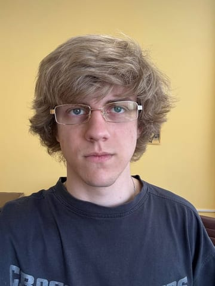

# About Me

 
     
    
 
        
 <strong>Vyacheslav Dmitriev</strong> 
 
        
 Python developer and backend architect from Belarus. I work with backend systems, server-side logic, and software architecture 
 
    
 

## Profile

My name is **Vyacheslav Dmitriev**. I am a **23-year-old man from [Belarus](https://en.wikipedia.org/wiki/Belarus)**.

I work as a **Python developer and backend architect**, with a focus on backend development, server-side logic, and software architecture

## Mindset

I am curious by nature and always interested in learning something new. I enjoy understanding how different fields work, from technology to culture

## Interests

One of my main interests is [**cinema**](https://www.imdb.com/user/p.t7gse6ybuhceox3466ofxcetyy). I am interested in film as an art form, a way of storytelling, and a reflection of time, society, and human experience

I also enjoy playing chess and learning about the cultures of other countries: their traditions, history, values, and ways of thinking
