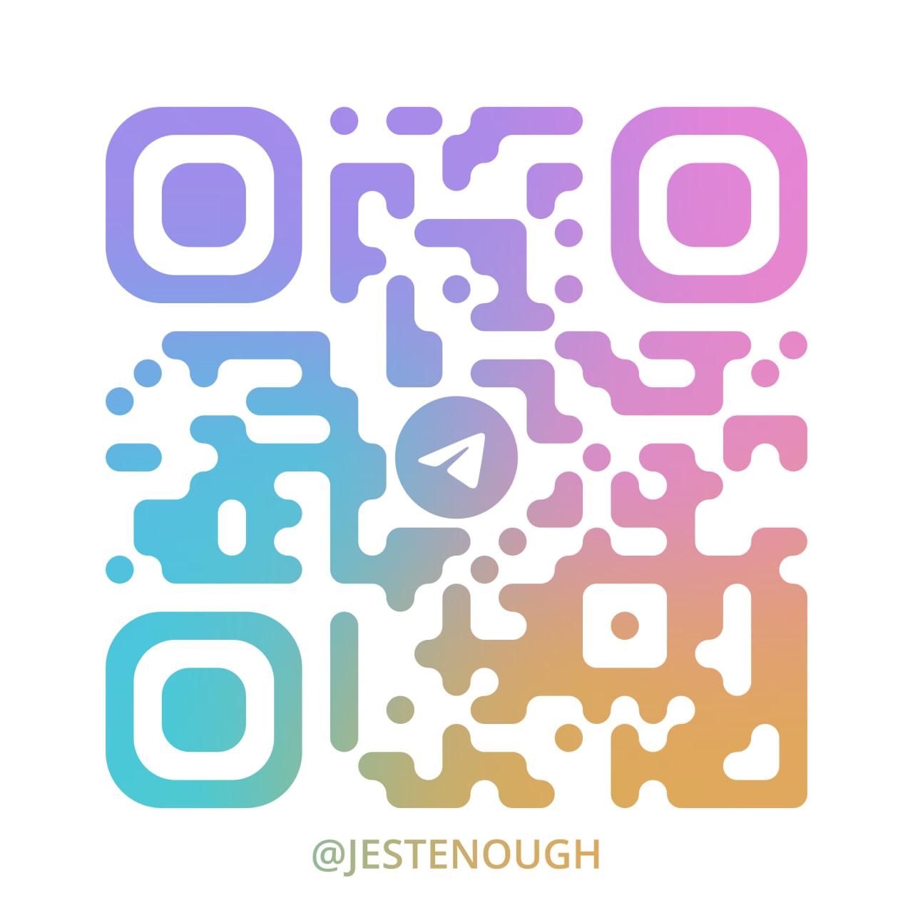

# Контакты

Публичные способы связаться со мной или найти меня онлайн

  

    
email (personal)

    <a href="mailto:jestenough.personal@gmail.com" target="_blank" rel="noopener noreferrer">jestenough.personal@gmail.com</a>
  

  

    
email (work)

    <a href="mailto:jestenough.work@gmail.com" target="_blank" rel="noopener noreferrer">jestenough.work@gmail.com</a>
  

  

    

      

        
telegram

        <a href="https://t.me/jestenough" target="_blank" rel="noopener noreferrer">@jestenough</a>
      

      
    

  

  

    

      

        
WeChat ID

        <code>jestenough</code>
      

      
    

  

  

    
matrix

    <code>@jestenough:matrix.org</code>
  

  

    
github

    <a href="https://github.com/jestenough" target="_blank" rel="noopener noreferrer">github.com/jestenough</a>
  

  

    
linkedin

    <a href="https://www.linkedin.com/in/jestenough/" target="_blank" rel="noopener noreferrer">linkedin.com/in/jestenough</a>
  

  

    
steam

    <a href="https://steamcommunity.com/id/virginhollywoodwhore/" target="_blank" rel="noopener noreferrer">virginhollywoodwhore</a>
  

  

    
youtube

    <a href="https://www.youtube.com/@servus-servorum-dei" target="_blank" rel="noopener noreferrer">@servus-servorum-dei</a>
  

